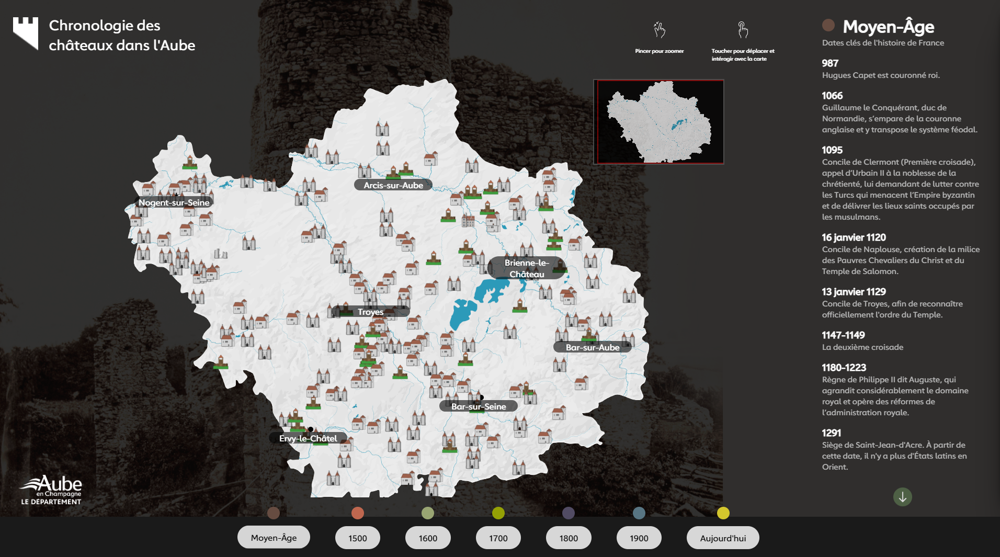
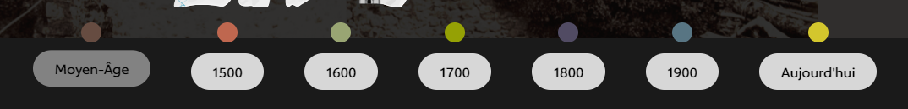
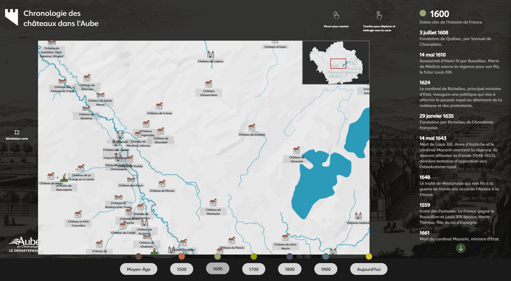
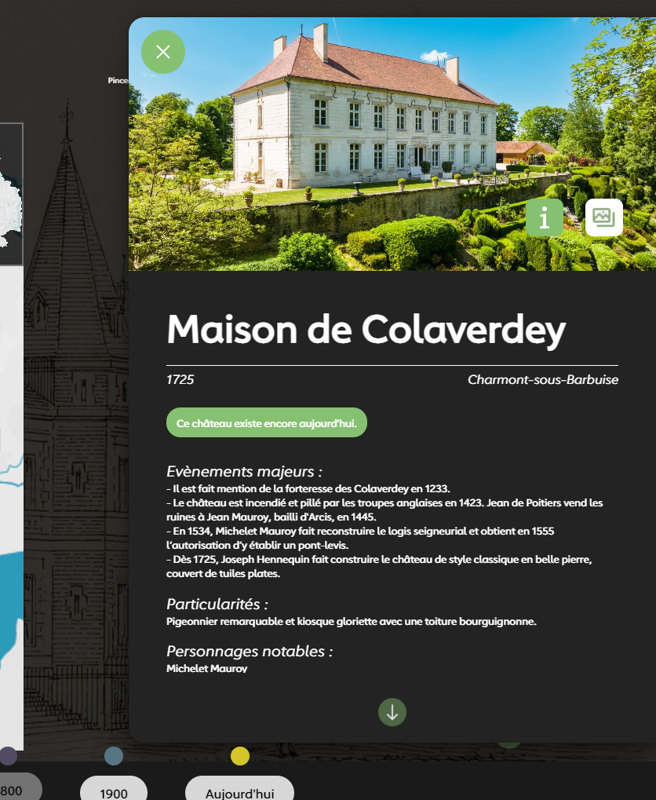
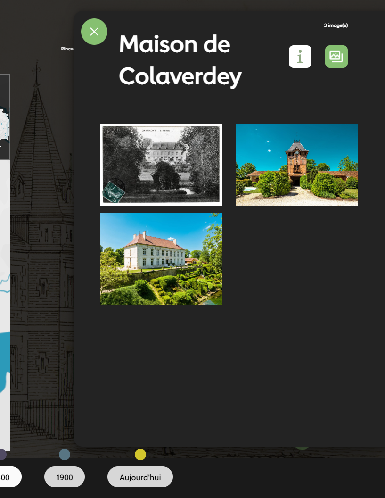
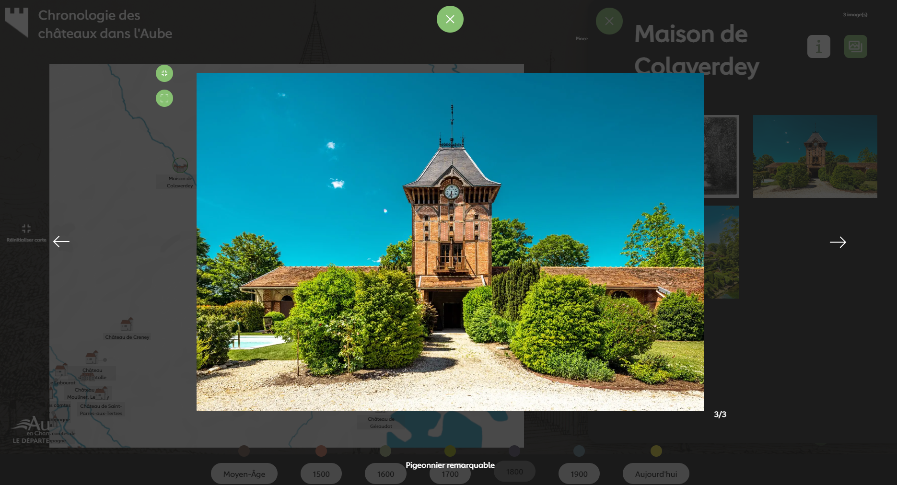

# Chronologie des châteaux dans l'Aube

**Chronologie des châteaux dans l'Aube** est une application de bureau exécutable sur Windows. Elle propose un affichage dynamique des châteaux présents dans le département de l'Aube de la région Grand-Est de France. Vous pourrez y parcourir une carte présentant des châteaux sur lesquels vous pourrez cliquer afin de consulter diverses informations ainsi que des galeries de photos d'archives. **Chronologie des châteaux dans l'Aube** est le fruit d'un travail de recherche acharné, permettant pour la première fois de présenter de manière interactive et dynamique l'Histoire de ces grands bâtiments de l'Aube à travers les époques.

## Utilisation de l'Application

### Prérequis

**Chronologie des châteaux dans l'Aube** est destiné à être lancé sur le système d'exploitation Windows. 
L'application est tout à fait consultable sur un écran d'ordinateur, mais a été conçue dans l'optique d'être lancée sur une **tablette d'exposition numérique interactive**. Elle est donc optimisée pour des écrans tactiles de large dimension.

### Installation

##### Si vous téléchargez l'application depuis Github (projet Vue.js) :


<p style="color: blue;">Lancer le projet</p>

Cloner le projet depuis Github :
```bash
  git clone https://github.com/OkeniteAnimation/P_8175-CG10-Chateaux-Aube-Expo.git
```

Se déplacer dans le projet cloné :
```bash
  cd P_8175-CG10-Chateaux-Aube-Expo
```

Installer les dépendances :
```bash
  npm install
```

Lancer le projet et le serveur de développement
```bash
  npm run dev
```

<p style="color: blue;">Déployer le projet</p>

Il suffit d'éxecuter la commande suivante :
```bash
  npm run build
```

Après quelques secondes, vous trouverez dans le projet un dossier '/dist', qui contiendra le projet buildé. Il faudra alors publier et lancer ce dossier depuis un serveur web.

<p style="color: blue;">Build l'exécutable</p>

```bash
  npm run electron:build32
```
Après quelques secondes, vous trouverez dans le projet un dossier '/XXX-chronologie-des-chateaux'. Ouvrez-le, et lancez 'XXX-chronologie-des-chateaux.exe'. Vous êtes libre de renommer le dossier et le .exe comme vous le souhaitez.

##### Si vous avez téléchargé la version exécutable :
1. Décompressez l'archive téléchargée à l'aide de Winrar ou d'un logiciel similaire.
2. Ouvrez le dossier 'chronologie-des-chateaux'
3. Double cliquez sur 'chronologie-des-chateaux.exe'

<u>Note</u> : Vous pouvez quitter l'application en appuyant simultanément sur **Ctrl+W**, ou bien en appuyant sur **F11** puis en cliquant sur la croix.


### Comment utiliser _Chronologie des châteaux dans l'Aube_

Une fois l'application lancée, vous devriez voir ceci :


Cliquez sur les boutons ci-dessous afin d'afficher les informations relatives à chaque époque :


Zoomez sur la carte avec vos doigts ou avec la molette de la souris afin de faire apparaître les noms des châteaux. Vous pouvez revenir à la vue d'ensemble grâce au bouton situé à gauche de la carte :


Touchez une icône de château pour afficher un panneau coulissant présentant toutes les informations importantes sur le château en question :


Cliquez sur le bouton à droite dans l'image de couverture pour accéder à une galerie de photos et d'images du château en question :


Cliquez sur une photo de votre choix pour la voir s'afficher en taille réelle. 
* Utilisez les flèches pour naviguer dans la galerie.
* Zoomez à votre guise sur l'image de la même manière que sur la carte, avec vos doigts ou avec la molette de la souris.
* Cliquez sur le premier bouton parmi les deux situés à gauche de l'image pour revenir au niveau de zoom initial.
* Cliquez sur le deuxième bouton pour afficher l'image en plein écran.



<u>Note</u> : Cliquez sur le logo de l'application, tout en haut à gauche de l'écran, afin de recharger l'application.

### Documentation complète

Si vous avez une documentation complète ou des ressources supplémentaires pour l'utilisation de l'application, mentionnez-les ici et fournissez des liens appropriés.

## Développement

## Commandes NPM
 
Toutes les commandes listées ci-dessus sont situées dans le fichier `package.json`
dans la section "script".

```bash
 "scripts": {
          "dev": "vite",
          "build": "vite build",
          "preview": "vite preview"
    },
```
Les scripts s'executent toujours avec "npm run *nom du script*" 


## Documentations & technologies utilisées

- [Documentation VueJS](https://vuejs.org/guide/introduction.html)
- [Documentation SCSS](https://sass-lang.com/documentation/)
- [Documentation OpenSeadragon](https://openseadragon.github.io/)


# Mentions


# Developpeur

- [@shams-benhamou](https://github.com/Taiyousan)

